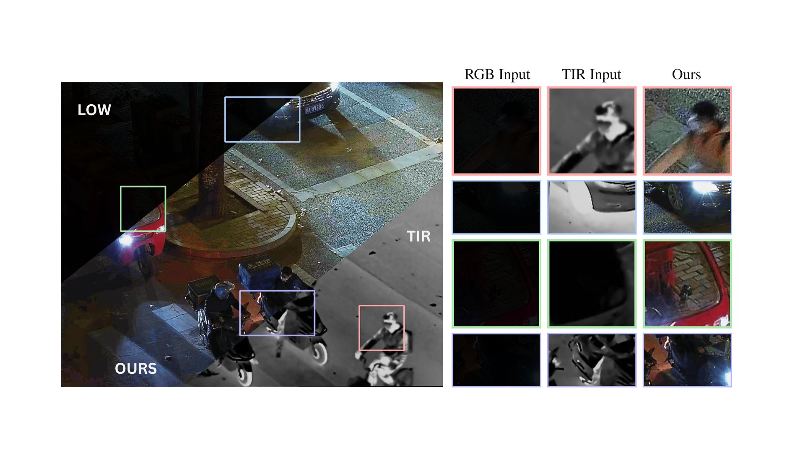
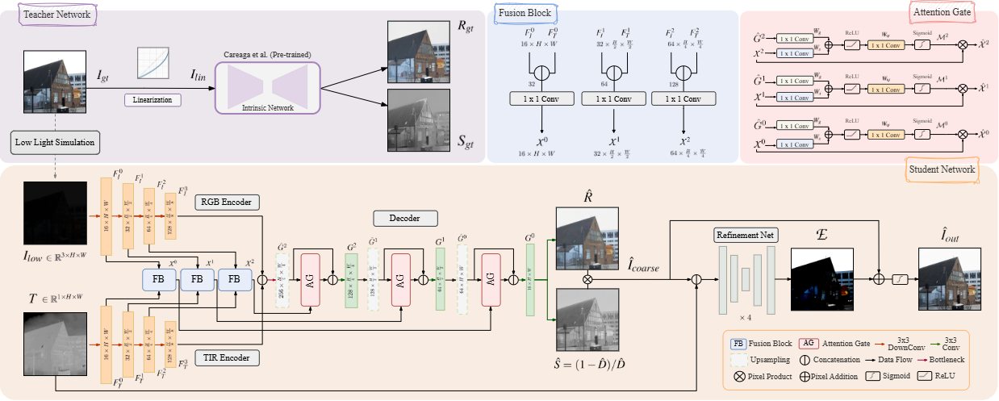

# TIRGlow: A Multimodal Intrinsics-Guided Thermal-Aware Framework for RGB Low-Light Image Enhancement

This is the official implementation of the paper accepted for publication at the **33rd IEEE International Conference on Image Processing (ICIP 2026)**.


[](https://2026.ieeeicip.org/)
[](LICENSE)
[](https://pytorch.org/)

---

<p align="center">
  
</p>

**Authors:** Simone Melcarne and Jean-Luc Dugelay || Eurecom Research Center, Digital Security Department, Biot, France


---


## The Framework

<p align="center">
  
</p>

Low-light image enhancement (LLIE) is challenging when the visible signal is severely degraded by noise and information loss. We propose a **Multimodal Intrinsics-Guided Framework** that fuses low-light RGB and thermal infrared (TIR) data to reconstruct well-lit images, explicitly leveraging the physical structure of image formation:

$$I = R_{RGB} \odot S_{gray}$$

where $R \in \mathbb{R}^{3 \times H \times W}$ is the illumination-invariant reflectance and $S \in \mathbb{R}^{1 \times H \times W}$ is the shading component that captures light distribution and geometry.

### Key Components

* **Teacher–Student Distillation:** Since no ground-truth reflectance/shading exists for LLIE, a frozen, pretrained intrinsic decomposition network ([Careaga & Aksoy](https://github.com/compphoto/Intrinsic)) acts as a **teacher**, processing the normal-exposure image to produce target reflectance $R_{gt}$ and shading $S_{gt}$ maps that supervise the student.
* **Dual-Encoder Fusion (FB):** Independent RGB and TIR encoders extract multi-scale features, fused at every resolution level through **Fusion Blocks**.
* **Multi-Scale Attention Gating (AG):** Inspired by Attention U-Net, gated skip connections selectively inject thermal structural details only where the visible signal is degraded, suppressing thermal noise elsewhere:

$$\hat{X}^{l} = X^{l} \odot M^{l}, \qquad M^{l} = \sigma\left(W_\psi \, \phi\left(W_x X^{l} + W_g \hat{G}^{l}\right)\right)$$

* **Coarse Reconstruction:** The decoder predicts reflectance $\hat{R}$ and (inverse) shading $\hat{D}$, which are combined via the intrinsic law to obtain a coarse linear reconstruction $\hat{I}_{coarse} = \hat{R} \odot \hat{S}$.
* **Residual Refinement Net:** A stack of Residual Blocks, conditioned on the thermal input, predicts a residual correction map to recover fine details and produce the final output $\hat{I}_{out}$.
* **Composite Objective:** End-to-end training combines reflectance/shading supervision, a physical-consistency loss against the coarse reconstruction, and a refinement loss (pixel + edge + CIELAB color + VGG perceptual) on the final sRGB output.

---

## Dataset Preparation

Training requires triplets of low-light RGB $I_{low}$, thermal $T$, and well-lit ground truth $I_{gt}$. The model is trained on **HDRT** (via a physics-based low-light simulation pipeline) and evaluated zero-shot on **LLVIP** and **V-TIEE**.


1. **HDRT Dataset (Thermal & HDR/SDR RGB) — training:**
   Official dataset page: [https://huggingface.co/datasets/jingchao-peng/HDRTDataset](https://huggingface.co/datasets/jingchao-peng/HDRTDataset)
   Paper / project details: [HDRT: A Large-Scale Dataset for Infrared-Guided HDR Imaging](https://arxiv.org/abs/2406.05475)

2. **LLVIP Dataset (Thermal & RGB) — zero-shot evaluation:**
   Official project page: [https://bupt-ai-cz.github.io/LLVIP/](https://bupt-ai-cz.github.io/LLVIP/)

3. **V-TIEE Dataset (Thermal & RGB) — zero-shot evaluation:**
   Released alongside RT-X Net: [https://github.com/jhakrraman/rt-xnet](https://github.com/jhakrraman/rt-xnet)


## Installation
--


## Citation

If you find this work useful, please cite:

```bibtex
@INPROCEEDINGS{11630490,
  author={Melcarne, Simone and Dugelay, Jean-Luc},
  booktitle={2026 IEEE International Conference on Image Processing (ICIP)}, 
  title={A Multimodal Intrinsics-Guided Thermal-Aware Framework for RGB Low-Light Image Enhancement}, 
  year={2026},
  volume={},
  number={},
  pages={1-6},
  keywords={Lighting;Color;Modeling;Printing;Image enhancement;Poles and zeros;Equations;Reflectivity;Training;Noise;Low-light Image Enhancement;Multimodal Fusion;Thermal Infrared;Intrinsic Decomposition},
  doi={10.1109/ICIP61757.2026.11630490}}
```

<!-- TODO: aggiorna il BibTeX con i dati definitivi (pagine, DOI, ISBN) non appena disponibili negli atti della conferenza. -->
